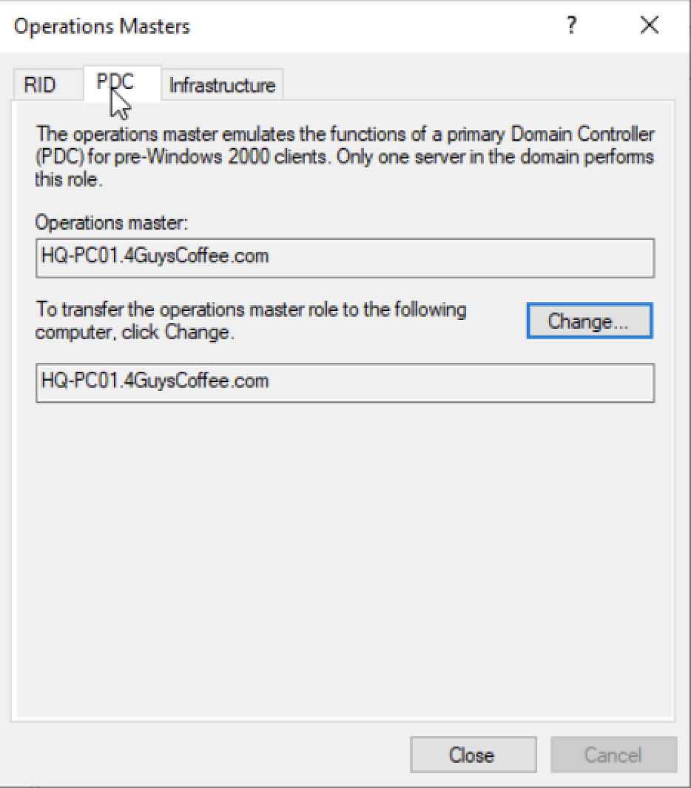
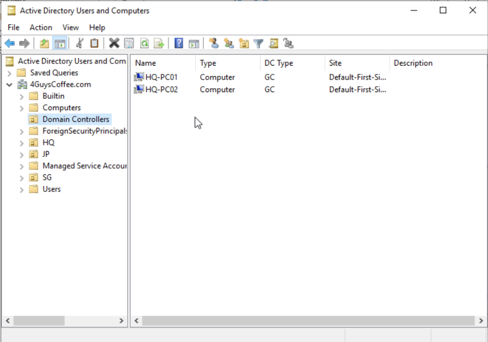

<a name="readme-top"></a>

# Capstone Project

<!-- PROJECT LOGO -->
<br />
<div align="center">
  <a href="https://www.4guyscoffee.co/" target=”_blank”>
    
  </a>
</div>

<!-- TABLE OF CONTENTS -->
<details>
  <summary>Table of Contents</summary>
  <ol>
    <li>
      <a href="#disclaimer">Disclaimer</a>
    </li>
    <li>
      <a href="#background">Background</a>
    </li>
    <li>
      <a href="#infrastructures">Infrastructures</a>
      <ul>
        <li>
          <a href="#networking">Networking</a>
          <ul>
            <li><a href="#distribution--core-layer">Distribution & Core Layer</a></li>
          </ul>
        </li>
        <li>
          <a href="#cloud-operations">Cloud Operations</a>
          <ul>
            <li><a href="#aws-cloudtrail">AWS CloudTrail</a></li>
            <li><a href="#aws-cloudwatch">AWS CloudWatch</a></li>
            <li><a href="#other-aws-resources">Other AWS Resources</a></li>
          </ul>
        </li>
        <li>
          <a href="#server-administration">Server Administration</a>
          <ul>
            <li><a href="#importance-of-active-directory">Importance of Active Directory</a></li>
            <li><a href="#demonstrating-our-active-directory-setup">Demonstration of Active Directory</a></li>
            <li><a href="#active-directory-installation">Active Directory Installation</a></li>
            <li><a href="#adding-a-pc-to-the-server">Adding a PC to the Server</a></li>
            <li><a href="#creating-organizational-units-(OUs)-and-security-groups">Creating Organizational Units (OUs) and Security Groups</a></li>
            <li><a href="#securing-active-directory">Securing Active Directory</a></li>
            <li><a href="#linux-server-administration">Linux Server Administration</a></li>
          </ul>
        </li>
      </ul>
    </li>
    <li>
      <a href="#cybersecurity">Cybersecurity</a>
        <ul>
          <li><a href="#background--scope">Background & Scope</a></li>
          <li>
            <a href="#digital-skimming">Digital Skimming</a>
              <ul>
                <li><a href="#impacts-&-consequences">Impacts & Consequences</a></li>
                <li><a href="#trend-analysis">Trend Analysis</a></li>
              </ul>
          </li>
          <li>
            <a href="#case-study-1-british-airways-magecart-attack">Case Study 1: British Airways Magecart Attack</a>
              <ul>
                <li><a href="#how-magecart-attacks-could-affect-4guyscoffee">How Magecart Attacks Could Affect 4GuysCoffee</a></li>
                <li><a href="#suggested-controls--mitigation">Suggested Controls & Mitigation</a></li>
              </ul>
          </li>
          <li>
            <a href="#case-study-2-starbucks-data-breach">Case Study 2: Starbucks Data Breach</a>
              <ul>
                <li><a href="#overview-of-the-data-breach">Overview of the Data Breach</a></li>
                <li><a href="#attack-vectors">Attack Vectors</a></li>
                <li><a href="#solutions">Solutions</a></li>
              </ul>
          </li>
        </ul>
    </li>
    <li><a href="#progress">Progress</a></li>
    <li><a href="#team-members">Team Members</a></li>
    <li><a href="#built-with">Built With</a></li>
    <li><a href="#acknowledgments">Acknowledgments</a></li>
    <li><a href="#references">References</a></li>
  </ol>
</details>

## Disclaimer

The company mentioned in this document, "4GuysCoffee," is entirely fictitious and has been created for the purpose of this project. Any resemblance to real entities, living or dead, is purely coincidental.

This project serves as a demonstration of our capabilities in utilising the tools, frameworks, and methodologies learnt during our course of study. While the company and its operations are fictional, the techniques and practices showcased herein reflect our proficiency in applying theoretical knowledge to practical scenarios.

The solutions presented in this project are intended for educational and illustrative purposes, showcasing our skills and understanding of industry-standard tools. The applicability of these techniques in real-world scenarios is subject to specific business requirements, security considerations, and best practices relevant to actual organisational settings.

This project should not be misconstrued as representing the operations, strategies, or policies of any existing or potential real-world entities. The goal is to highlight our ability to implement and integrate various technologies in a manner that could be replicated and adapted in professional environments.

Readers are encouraged to consider the context of this project as a simulated exercise, aimed at demonstrating our commitment to continuous learning and the practical application of knowledge in the field of IT.

<p align="right">(<a href="#readme-top">back to top</a>)</p>


## Background

Welcome to 4GuysCoffee. We are a Singapore-based small and medium enterprise, stands as a premier destination for exceptional coffee experiences. Operating exclusively within the dynamic city-state of Singapore, we curate an exquisite selection of premium coffee beans sourced from diverse countries, ensuring a rich and high-quality offering. Our local facility in Singapore meticulously roasts and processes these beans, packaging them for sale and use in our six cafes spread across the city-state.

This document offers a detailed insight into 4GuysCoffee's network infrastructure, carefully developed at our headquarters in Singapore using cutting-edge tools from Cisco. Our setup incorporates advanced configurations of switches, routers, and access points, ensuring flawless connectivity and performance. We've employed subnets and Virtual Local Area Networks (VLANs) to boost organisational efficiency, fortify network security, and optimise data traffic management.

In embracing cloud technology for scalability, we've established a web server on Amazon Web Services (AWS). Our identity management system relies on Windows Active Directory for centralised and secure user authentication. Moreover, both local and AWS file servers facilitate collaboration and extend our data storage capabilities, incorporating solutions like Amazon S3 for enhanced redundancy and accessibility.

To meet the needs of our cafe managers, we've implemented dedicated PC setups with secure Virtual Private Network (VPN) connections, enabling swift access to headquarters' resources. Our IT infrastructure is tailored to support operations within Singapore's dynamic coffee scene, prioritising resilience and efficiency. 

Finally, we've incorporated cybersecurity defence strategies and included our annual cybersecurity report to underscore our commitment to safeguarding operations.


<p align="right">(<a href="#readme-top">back to top</a>)</p>


## Infrastructures

### Networking

The network architecture adopts a best-in-class approach by implementing a 3-tier hierarchical design for the headquarters and a relatively simple design for the branches, widely acknowledged as an industrial best practice for creating reliable, scalable, and cost-effective networks (GeeksforGeeks, 2022). This design optimises network performance, facilitates seamless scalability to accommodate future growth, and ensures cost efficiency in network management and maintenance. The hierarchical structure provides a clear separation of functions, enhancing overall network reliability and robustness.

#### Distribution & Core Layer

* The network infrastructure is designed with a robust and resilient architecture, featuring a single HQ-router complemented by two multilayer switches for efficient inter-VLAN routing and enhanced redundancy through HSRP configuration. An EtherChannel is implemented between the switches to optimise bandwidth and load balancing, significantly boosting overall network performance. The utilisation of subnets and VLANs in tandem forms a multilayer security approach, strategically addressing vulnerabilities in both Layers 2 and 3.

* To future-proof the network for business growth, subnet selection follows Cisco's addressing guide recommendations, employing VLSM while allowing space for growth /16 and /24 for the HQ and various departments, ensuring scalability. Layer 2 security is prioritised with measures like PortFast, BPDUguard, port security, and auto-trunking disabling to fortify against potential attacks.

* Routing is achieved through OSPF, chosen for its compatibility with heterogeneous networks, as opposed to EIGRP, which is limited to homogeneous networks. WLAN security is bolstered with RADIUS server authentication, providing users with unique username and password combinations for heightened access control. For secure site-to-site connections, IPSec VPNs are implemented.

<p align="right">(<a href="#readme-top">back to top</a>)</p>

### Cloud Operations

Embracing the cloud for scalability and flexibility, we have established a web server through an Elastic Compute Cloud (EC2) instance on Amazon Web Services (AWS). This cloud-based approach ensures robust and reliable web hosting capabilities. In terms of identity management, 4GuysCoffee’s head office is equipped with Windows Active Directory, providing a centralized and secure means of managing user authentication and authorisation. Simultaneously, a local file server on-premise facilitates seamless file sharing and collaboration among our internal teams. Expanding their data storage capabilities, we have also incorporated a file server on AWS, exploring various storage solutions such as Amazon S3. This not only serves as an off-site backup but also enhances data redundancy and accessibility.

#### AWS CloudTrail

The implementation of AWS CloudTrail for 4GuysCoffee is a strategic move that aligns with our commitment to transparency, security, and operational excellence. With CloudTrail, we gain unparalleled visibility into every interaction within our AWS infrastructure. This means we can monitor and audit changes made to our resources, ensuring that our AWS environment is secure and compliant. The detailed logs, stored securely in dedicated S3 buckets, are crucial for forensic analysis and compliance reporting. CloudTrail's ability to track data events, especially in our S3 storage, enhances our understanding of resource access and modification, offering valuable insights for continuous improvement.

#### AWS CloudWatch

AWS CloudWatch emerges as a vital tool in our quest for real-time monitoring and actionable insights. By creating custom dashboards, we consolidate key metrics from various AWS resources, giving us a holistic view of our operational landscape. Alarms set in CloudWatch allow us to respond promptly to deviations from normal operating conditions. This means proactive issue resolution and improved overall system reliability. CloudWatch Logs centralises our log management, simplifying debugging and performance monitoring for our applications. Creating custom metrics ensures a tailored understanding of our application's performance, empowering us to optimise user experiences across our cafes and e-commerce platforms.

The integration of AWS CloudTrail, CloudWatch, and Simple Notification Service (SNS) stands as a pivotal enhancement for 4GuysCoffee, offering a holistic approach to monitoring and managing our AWS infrastructure. With CloudTrail, we gain a meticulous audit trail of every interaction, ensuring transparency and bolstering our commitment to security and compliance. The seamless integration with CloudWatch allows us real-time visibility into our operational landscape through custom dashboards, empowering us to address issues and optimise system reliability proactively. CloudWatch Alarms, integrated with SNS, provide instant notifications, ensuring that our team stays informed about critical events, from security breaches to operational anomalies. This trifecta of services fortifies our ability to maintain the integrity of our AWS environment and streamline communication, enabling swift responses to potential challenges. As a result, our commitment to a secure, efficient, and customer-focused operation in the global coffee industry is further solidified, ensuring that we stay ahead in this dynamic and competitive market.

#### Other AWS Resources

4GuysCoffee harnesses a robust set of AWS services to optimise its operations comprehensively. Amazon DynamoDB facilitates real-time inventory management across cafes and warehouses with its scalable NoSQL database, while AWS IoT Core connects smart sensors for efficient monitoring and control. Amazon EC2 ensures a scalable and highly available hosting environment for the e-commerce platform, supported by Amazon S3 for secure storage of product images and content. The global reach is enhanced through Amazon CloudFront, providing faster content delivery. Streamlining global operations is achieved with Amazon VPC, and AWS Lambda facilitates automation. In pursuing sustainability and security, AWS Greengrass manages energy consumption, and AWS WAF and AWS CloudTrail ensure robust cybersecurity measures. These services empower 4GuysCoffee to thrive in a dynamic, secure digital landscape while delivering an enhanced customer experience.

<p align="right">(<a href="#readme-top">back to top</a>)</p>

### Server Administration

This section serves as a comprehensive guide to understanding our company's decision to leverage Active Directory and outlines the meticulous process we've undertaken to establish a robust and secure directory service for our organisation.

At 4GuysCoffee, our primary goal is to streamline and enhance our internal IT infrastructure. By implementing Active Directory, we aim to create a centralised and organised network that efficiently manages user accounts, facilitates seamless resource access, and ensures a secure and scalable environment. This move is part of our commitment to improving operational efficiency and providing a secure foundation for our company's growth.

#### Importance of Active Directory:

Active Directory plays a pivotal role in modern IT environments. It not only simplifies user management but also provides a centralised platform for authentication, authorisation, and configuration management. With AD in place, we anticipate improved security, reduced administrative overhead, and enhanced productivity as employees gain simplified access to network resources.

#### Demonstrating Our Active Directory Setup:

This section is designed to walk you through the step-by-step process of setting up our Active Directory domain, "4GuysCoffee." From initial planning to the execution of domain controllers and the configuration of essential AD components, this document will serve as a comprehensive reference and gain you insights into the meticulous planning and implementation of our Active Directory setup and the measures we've taken to fortify our network against potential security vulnerabilities. Thank you for being part of this crucial initiative at 4GuysCoffee!

#### Active Directory Installation

[](https://www.youtube.com/watch?v=k5VWd_0uTiQ&t=0s)

Active Directory Domain Services (AD DS) is a critical component in Windows Server environments, and its importance is underscored by several key functionalities and benefits.

These are comprehensive steps that should be taken to ensure the AD DS is up and running correctly.

1. Prepare the Server:
    * Ensure the server has a static IP address.
    * Set the server's DNS to its own IP address.

2. Open Server Manager:
    * Launch Server Manager from the taskbar or Start menu.

3. Add Roles and Features:
    * Click on "Manage" and then select "Add Roles and Features."
    * Follow the wizard to select the server and add the "Active Directory Domain Services" role.

4. Configure Role Services:
    * In the "Add Roles and Features Wizard," click "Next" until the "Select server roles" page.
    * Choose "Active Directory Domain Services."
    * Follow the prompts to add required features.

5. Install AD DS:
    * Review the information and click "Install" to begin the installation.

6. Promote the Server to a Domain Controller:
    * After the installation, a notification will appear. Click on "Promote this server to a domain controller."

7. Active Directory Domain Services Configuration Wizard:
    * Choose "Add a new forest" if this is the first domain controller in the forest.
    * Enter the root domain name (e.g., 4GuysCoffee.com).
    * Set the Directory Services Restore Mode (DSRM) password.
    * Review the NetBIOS name suggestion.

8. Domain Controller Options:
    * Choose the domain and forest functional levels.
    * Configure DNS options if needed.

9. Additional Options:
    * Specify the location for the AD DS database, log files, and SYSVOL.
    * Review settings and click "Next."

10. Review Options:
    * Review the configuration settings and click "Install."

11. Complete the Installation:
    * After the server restarts, log in using the domain administrator credentials.

#### Post-Installation Steps:

1. Verify Active Directory Installation:
    * Open "Active Directory Users and Computers" to confirm the AD structure.

2. Configure DNS:
    * Verify DNS settings to ensure proper resolution.

3. Update DHCP Settings (if applicable):
    * If the network uses DHCP, update DHCP settings to point to the new domain controller for DNS.

4. Backup:
    * Regularly back up the domain controller, especially the Active Directory database.

5. In our case, we have added extra domain controllers (DC). These are the steps we took:
    * Configure the Static IP for the new PC.
    * As for DNS, make sure it is set according to the DNS address of the main DC.
    * Add AD DS and DHCP roles as per guided in previous steps.
    * Promote the new PC as a Domain Controller.
    * Flexible Single Master Operation, or FSMO roles can also be configured from the Active Directory Users and Computers tool.
    * Tip: The current FSMO roles can be determined by running this command in the command prompt
    ```sh
    netdom query fsmo
    ```
    
    
<!-- * npm
  ```sh
  npm install npm@latest -g
  ``` -->

#### Adding a PC to the Server

Prerequisites
Before proceeding, make sure the following prerequisites are met:
  * The PC and Active Directory server are on the same network.
  * The PC has a valid IP address and can communicate with the Active Directory server.
  * You have administrative credentials for the Active Directory domain.

1. Access System Properties on the PC:
    * Right-click on "This PC" or "Computer" on your desktop or in the File Explorer.
    * Select "Properties" from the context menu.

2. Access System Info:
    * In the System Properties window, click on "Advanced system settings" on the left sidebar.

3. Join a Domain:
    * In the System Properties window, under the "Computer Name" tab, click on the "Change" button.

4. Enter Domain Information:
    * Select the option for "Domain" and enter the name of your Active Directory domain.
    * Click "OK."

5. Provide Credentials:
    * You will be prompted to provide credentials for an account that has permission to join computers to the domain. Enter the username and password of a domain administrator.
    * Click "OK."

6. Confirm Domain Join:
    * A dialog box will confirm the successful connection to the domain.
    * Click "OK."

7. Restart the PC:
    * You will be prompted to restart the computer to apply the changes.
    * Click "Restart Now" or restart the PC manually.

8. Log in with Domain Credentials:
    * After the restart, on the login screen, select the domain from the drop-down menu.
    * Log in using domain credentials (username and password).


#### Creating Organizational Units (OUs) and Security Groups

1. Open Active Directory Users and Computers

2. In the left pane, expand the domain node.

3. Create Organizational Unit:
    * Right-click on the domain node or an existing OU where you want to create the new OU.
    * Select "New" and then choose "Organizational Unit."

4. Enter OU Name:
    * Provide a name for the new OU and click "OK."

5. Creating Security Groups:
    * Right-click on the domain node or an existing OU where you want to create the new security group.
    * Select "New" and then choose "Group."

6. Enter Group Information:
    * Enter a name for the security group.
    * Choose the group scope (e.g., Global, Domain Local, Universal) based on your requirements.
    * Choose the group type (e.g., Security, Distribution) based on whether the group will be used for security or distribution purposes.
    * Click "OK."

7. Group Membership:
    * After creating security groups, you can manage their membership by double-clicking on the group and adding members in the "Members" tab.


#### Securing Active Directory

Ensuring the security of our Active Directory environment is of paramount importance to us. Following are the specific strategies we have implemented to harden our AD setup:

1. Group Policy Objects (GPOs) to enforce security settings such as password policies (enforce strong passwords, length of the passwords, expiration, etc), and user rights assignments.
2. Account lockout policies to limit login attempts and protect against brute-force attacks.
3. We have configured the [GPO Rules](https://youtu.be/aSS2KEWCLHo) to turn the firewalls on automatically in all of our workstations and disallow users to disable them. 
4. Inbound [Firewall Rules](https://youtu.be/vZaHpq-9_o0) allow only essential traffic to our domain controllers, limit unnecessary ports and services and implement outbound firewall rules to restrict unnecessary communication from domain controllers.
5. Implement regular updates, scanning and patching to address vulnerabilities promptly.
6. Disable SMB1 & Link-Local Multicast Name Resolution (LLMNR) via GPO.
7. Disable NetBOIS Name Service (NBT-NS) via PowerShell.
8. Utilise [non-standard port configurations](https://youtu.be/7x_JVszswqc) for Remote Desktop Protocol (RDP) to minimise attack surface.
9. Physical security measures are also in place to protect servers housing domain controllers.
10. Finally, in the context of preventing the evolving social engineering attacks and phishing attempts, we conduct security awareness training for users to prevent social engineering attacks and phishing attempts.

<p align="right">(<a href="#readme-top">back to top</a>)</p>


#### Linux Server Administration

Securing a Linux server involves a series of fundamental steps to fortify its defenses against potential threats and vulnerabilities. It is crucial to keep the system software and applications up-to-date by regularly applying security patches. Implementing strong password policies and ensuring that only necessary services are running help reduce the attack surface. Disabling unnecessary user accounts and employing multi-factor authentication further strengthens access controls.

Additionally, configuring firewalls, such as iptables, to control incoming and outgoing traffic enhances network security. Restricting access through the use of SSH keys rather than passwords adds an extra layer of protection. Regularly auditing and monitoring system logs provide insights into potential security incidents, enabling timely response and mitigation.

The benefits of hardening a Linux server are multifaceted. Enhanced security measures reduce the risk of unauthorized access, data breaches, and potential disruptions. By minimising unnecessary services and tightening access controls, the attack surface is diminished, making it more challenging for malicious actors to exploit vulnerabilities. Regular system audits contribute to early threat detection and allow for proactive measures to maintain the integrity and reliability of the server. In essence, the hardening process is an essential practice for safeguarding the server's overall stability and protecting sensitive information from potential cyber threats.

<p align="right">(<a href="#readme-top">back to top</a>)</p>

<!--
_Below is an example of how you can instruct your audience on installing and setting up your app. This template doesn't rely on any external dependencies or services._

1. Get a free API Key at [https://example.com](https://example.com)
2. Clone the repo
   ```sh
   git clone https://github.com/your_username_/Project-Name.git
   ```
3. Install NPM packages
   ```sh
   npm install
   ```
4. Enter your API in `config.js`
   ```js
   const API_KEY = 'ENTER YOUR API';
   ```

<p align="right">(<a href="#readme-top">back to top</a>)</p>

-->

<!-- ROADMAP -->
## Cybersecurity

This section contains excerpts from our Annual Cybersecurity Report. To view the detailed report, click [here](HTDOCS/doc/cs-report.pdf).

### Background & Scope

In light of 4GuysCoffee's global success in the coffee industry, the company acknowledges the increasing risk of cyberattacks. The expansion into e-commerce has exposed vulnerabilities, particularly to <strong>digital skimming</strong> and related threats. To bolster defence measures, a comprehensive cybersecurity approach is embraced. This strategy, incorporating employee training, continuous security assessments, robust encryption, and expert collaboration, aims to fortify resilience against evolving digital threats. This report reflects the company's steadfast commitment to safeguarding its digital assets. It delves into common cybercrimes, presents case studies, identifies potential weaknesses, and outlines concrete steps to mitigate risks like digital skimming. By adopting these preventative measures, the company safeguards not only its digital storefront but also the trust and security of its valued customers.

### Digital Skimming

Digital Skimming, identified as a significant cybersecurity threat by Visa's Biannual Threats Report of 2022, involves cybercriminals injecting malicious code into a merchant's website. This code targets checkout pages to harvest payment account details and personally identifiable information. Such attacks exploit misconfigurations or inadequate security controls, allowing cybercriminals to deploy the skimming code successfully. Also known as Magecart attacks, digital skimming involves covertly inserting malicious code into payment processing pages to capture sensitive customer information, such as credit card details, during online transactions.

#### Impacts & Consequences

As reported by Visa, the evolution of digital skimming tactics poses severe consequences. Cybercriminals can gain control over e-commerce platforms, harvesting payment account data and compromising customers' financial information. The aftermath of a successful digital skimming attack extends beyond financial losses, eroding customer trust and tarnishing the company's reputation. Individuals face the risk of unauthorised charges, fraudulent transactions, and potential identity theft. Meanwhile, affected businesses may incur fines, legal repercussions, and operational disruptions, leading to revenue loss.

#### Trend Analysis

The digital payment market is experiencing significant growth, driven by the widespread adoption of digital payments in online shopping. This growth is propelled by factors such as smartphone ubiquity, fast internet connectivity, and consumer preference for digital payments. However, this surge also increases exposure to e-skimming threats, posing challenges for detection and mitigation. Attackers continually refine their strategies, exploiting vulnerabilities such as misconfigured access controls on cloud platforms like Amazon S3.

### Case Study 1: British Airways Magecart Attack

In 2020, British Airways fell victim to a sophisticated Magecart attack, compromising sensitive customer payment details on its website's checkout page. Despite swift action to contain the breach, customer data was compromised, leading to significant repercussions under GDPR regulations. This incident underscores the threat posed by digital skimming attacks to businesses and highlights the importance of robust cybersecurity measures.

#### How Magecart Attacks Could Affect 4GuysCoffee

The potential for a Magecart attack poses a significant threat to 4GuysCoffee's online operations. Similar to British Airways' experience, the company's login and checkout pages could be targeted, compromising customer data and damaging the company's reputation. The clandestine nature of Magecart attacks makes them difficult to detect, necessitating proactive security measures to mitigate risks effectively.

#### Suggested Controls & Mitigation

To address the growing threat of Magecart attacks, 4GuysCoffee recommends implementing proactive security measures. These include regularly inspecting code for vulnerabilities, updating login credentials, securing cloud resources, and deploying web application firewalls. Additionally, proactive measures such as penetration testing and maintaining multi-layered security systems are crucial for thwarting intrusions and protecting customer data.

### Case Study 2: Starbucks Data Breach

In September 2022, Starbucks Singapore experienced a data breach affecting approximately 330,000 customers. The breach involved the unauthorized access and theft of customer data stored in a CRM system, highlighting vulnerabilities in data management and access controls. This case study underscores the importance of robust security policies and proactive measures to mitigate the risks of data breaches.

#### Overview of the Data Breach

The Starbucks Singapore data breach occurred due to vulnerabilities in the organization's CRM system and web platform. Weak access controls, lack of encryption, and insufficient detection measures contributed to the breach, resulting in the theft of sensitive customer information. Prompt action was taken to address the breach and notify affected customers, but significant challenges remain in strengthening data security measures.

#### Attack Vectors

The data breach was facilitated by several vulnerabilities, including weak access management, lack of encryption, and inadequate detection measures. These vulnerabilities allowed malicious actors to gain unauthorized access to customer data and exploit weaknesses in the organization's security infrastructure. Strengthening access controls, implementing encryption, and enhancing detection measures are essential for mitigating future risks.

#### Solutions

To mitigate the risks of data breaches, 4GuysCoffee recommends implementing comprehensive security policies and proactive measures. These include implementing multi-factor authentication, enforcing password hygiene protocols, and enhancing access management controls. Additionally, regular security audits, encryption of sensitive data, and improved detection measures are essential for maintaining robust data security practices. By adopting these solutions, organizations can strengthen their cybersecurity posture and protect against future data breaches.

<p align="right">(<a href="#readme-top">back to top</a>)</p>

## Progress

- [x] Add Background Information
- [x] Add Networking contents
- [x] Add AWS contents
- [ ] Add AWS screenshots
- [x] Add Active Directory contents
- [x] Add Linux contents
- [ ] Add Linux screenshots
- [x] Add Cybersecurity contents
- [ ] Add M5 contents
- [ ] Add M7 contents
- [ ] Add M6 contents
- [ ] Add M8 contents

<p align="right">(<a href="#readme-top">back to top</a>)</p>

<!--


## Contributing

Contributions are what make the open source community such an amazing place to learn, inspire, and create. Any contributions you make are **greatly appreciated**.

If you have a suggestion that would make this better, please fork the repo and create a pull request. You can also simply open an issue with the tag "enhancement".
Don't forget to give the project a star! Thanks again!

1. Fork the Project
2. Create your Feature Branch (`git checkout -b feature/AmazingFeature`)
3. Commit your Changes (`git commit -m 'Add some AmazingFeature'`)
4. Push to the Branch (`git push origin feature/AmazingFeature`)
5. Open a Pull Request

<p align="right">(<a href="#readme-top">back to top</a>)</p>


## License

Distributed under the MIT License. See `LICENSE.txt` for more information.

<p align="right">(<a href="#readme-top">back to top</a>)</p>

-->

<!-- CONTACT -->
## Team Members

<!-- * Andrew - [@x](https://twitter.com/x) - email@x.com -->
* [Brendan](https://) - email@x.com
* [Hud](https://) - email@x.com
* [Shafeeq](https://sg.linkedin.com/in/shafabdultalib) - shaf.abdul@outlook.com

<p align="right">(<a href="#readme-top">back to top</a>)</p>


## Built With

These are the frameworks, resources and languages used throughout the project.

* [![Apache][Apache]][Apache-url]
* [![AWS][Amazon-AWS]][AWS-url]
* [![Bash][Bash]][Bash-url]
* [![Canva][Canva]][Canva-url]
* [![Cisco][Cisco]][Cisco-url]
* [![CSS][CSS]][CSS-url]
* [![Github][Github]][Github-url]
* [![HTML][HTML]][HTML-url]
* [![JS][JS]][JS-url]
* [![JSON][JSON]][JSON-url]
* [![MariaDB][MariaDB]][MariaDB-url]
* [![Markdown][Markdown]][Markdown-url]
* [![NPM][NPM]][NPM-url]
* [![PHP][PHP]][PHP-url]
* [![Powershell][Powershell]][Powershell-url]
* [![Redhat][Redhat]][Redhat-url]
* [![VMWare][VMWare]][VMWare-url]
* [![VS][VS]][VS-url]
* [![Windows][Windows]][Windows-url]


<p align="right">(<a href="#readme-top">back to top</a>)</p>


<!-- ACKNOWLEDGMENTS -->
## Acknowledgments

We would like to extend our sincere gratitude to the following organisations and its people whose invaluable support and expertise have played a pivotal role in shaping and enriching our journey throughout the development of this project. 

This project would not have been possible without the collective effort, support, and knowledge shared by these entities. Thank you for being instrumental in the successful execution of this endeavor.

* [VISA](https://www.visa.com.sg)
* [IMDA](https://www.imda.gov.sg/)
* [School of InfoComm Technology](https://www.np.edu.sg/schools-courses/academic-schools/school-of-infocomm-technology)
* [AWS](https://aws.amazon.com/)
* [Windows AD Knowledge Base](https://learn.microsoft.com/en-us/windows-server/identity/ad-ds/get-started/virtual-dc/active-directory-domain-services-overview)
* [RHEL](https://www.redhat.com/en/technologies/linux-platforms/enterprise-linux)
* [GitHub Pages](https://pages.github.com)

<p align="right">(<a href="#readme-top">back to top</a>)</p>


## References

1. Lau, Deborah. “[The Big Read in Short: What’s Driving Singapore’s Coffee Craze?](https://www.todayonline.com/big-read/)” TODAY, November 4, 2023. big-read-short-whats-driving-singapores-coffee-craze-2297136 
2. “[Hierarchical Network Design](https://www.geeksforgeeks.org/hierarchical-network-design/).” GeeksforGeeks, November 17, 2022.
3. [IP addressing guide](https://www.cisco.com/c/dam/global/en_ca/solutions/strategy/docs/sbaBN_IPv4addrG.pdf) - Cisco. Accessed January 14, 2024.
4. [What is Amazon EC2?](https://docs.aws.amazon.com/AWSEC2/latest/UserGuide/concepts.html) - Amazon Elastic Compute Cloud. Accessed January 14, 2024.
5. Canadian Centre for Cyber Security, Canadian Centre for Cyber Security (Cyber Centre). “[Practitioner Guidance for Securing Microsoft Active Directory Services in Your Organization](https://www.cyber.gc.ca/en/guidance/practitioner-guidance-securing-microsoft-active-directory-services-your-organization-itsp60100).” ITSP.60.100, December 12, 2023.

<p align="right">(<a href="#readme-top">back to top</a>)</p>

<!-- MARKDOWN LINKS & IMAGES -->
<!-- https://www.markdownguide.org/basic-syntax/#reference-style-links -->
[contributors-shield]: https://img.shields.io/github/contributors/othneildrew/Best-README-Template.svg?style=for-the-badge
[contributors-url]: https://github.com/othneildrew/Best-README-Template/graphs/contributors
[forks-shield]: https://img.shields.io/github/forks/othneildrew/Best-README-Template.svg?style=for-the-badge
[forks-url]: https://github.com/othneildrew/Best-README-Template/network/members
[Amazon-AWS]: https://img.shields.io/badge/Amazon_AWS-FF9900?style=for-the-badge&logo=amazonaws&logoColor=white
[AWS-url]: https://www.aws.amazon.com 
[Cisco]: https://img.shields.io/badge/CISCO-1BA0D7?style=for-the-badge&logo=cisco&logoColor=white
[Cisco-url]: https://learningnetwork.cisco.com/s/packet-tracer-alternative-lab-solutions
[Github]: https://img.shields.io/badge/GitHub-100000?style=for-the-badge&logo=github&logoColor=white
[Github-url]: https://github.com/
[VMWare]: https://img.shields.io/badge/VMware-231f20?style=for-the-badge&logo=VMware&logoColor=white
[VMWare-url]: https://www.vmware.com
[Redhat]: https://img.shields.io/badge/Red%20Hat-EE0000?style=for-the-badge&logo=redhat&logoColor=white
[Redhat-url]: https://www.redhat.com/en/technologies/linux-platforms/enterprise-linux
[Windows]: https://img.shields.io/badge/Windows-0078D6?style=for-the-badge&logo=windows&logoColor=white
[Windows-url]: https://www.microsoft.com/en-us/windows
[JSON]: https://img.shields.io/badge/json-5E5C5C?style=for-the-badge&logo=json&logoColor=white
[JSON-url]: https://www.json.org/json-en.html
[VS]: https://img.shields.io/badge/VSCode-0078D4?style=for-the-badge&logo=visual%20studio%20code&logoColor=white
[VS-url]: https://code.visualstudio.com/
[Markdown]: https://img.shields.io/badge/Markdown-000000?style=for-the-badge&logo=markdown&logoColor=white
[Markdown-url]: https://www.markdownguide.org/
[Bash]: https://img.shields.io/badge/Shell_Script-121011?style=for-the-badge&logo=gnu-bash&logoColor=white
[Bash-url]: https://
[HTML]: https://img.shields.io/badge/HTML5-E34F26?style=for-the-badge&logo=html5&logoColor=white
[HTML-url]: https://
[CSS]: https://img.shields.io/badge/CSS3-1572B6?style=for-the-badge&logo=css3&logoColor=white
[CSS-url]: https://
[JS]: https://img.shields.io/badge/JavaScript-323330?style=for-the-badge&logo=javascript&logoColor=F7DF1E
[JS-url]: https://
[PHP]: https://img.shields.io/badge/PHP-777BB4?style=for-the-badge&logo=php&logoColor=white
[PHP-url]: https://www.php.net
[PHP]: https://img.shields.io/badge/PHP-777BB4?style=for-the-badge&logo=php&logoColor=white
[PHP-url]: https://
[MariaDB]: https://img.shields.io/badge/MariaDB-003545?style=for-the-badge&logo=mariadb&logoColor=white
[MariaDB-url]: https://mariadb.org
[Canva]: https://img.shields.io/badge/Canva-%2300C4CC.svg?&style=for-the-badge&logo=Canva&logoColor=white
[Canva-url]: https://www.canva.com
[Apache]: https://img.shields.io/badge/Apache-D22128?style=for-the-badge&logo=Apache&logoColor=white
[Apache-url]: https://www.apache.org
[NPM]: https://img.shields.io/badge/npm-CB3837?style=for-the-badge&logo=npm&logoColor=white
[NPM-url]: https://www.npmjs.com
[Powershell]: https://img.shields.io/badge/powershell-5391FE?style=for-the-badge&logo=powershell&logoColor=white
[Powershell-url]: https://www.microsoft.com
